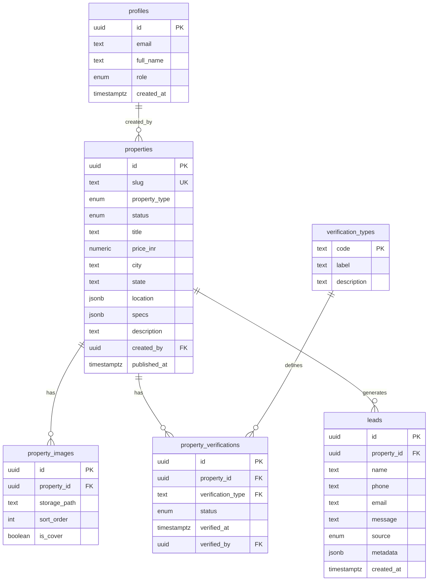
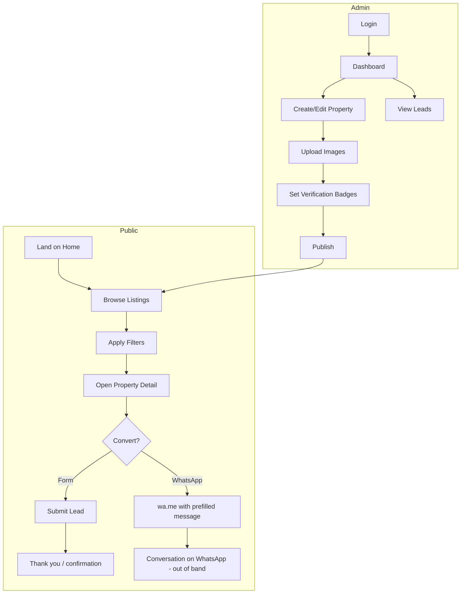
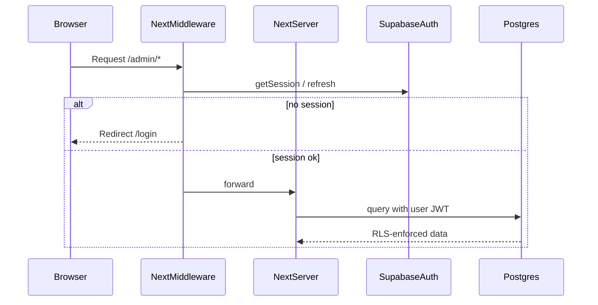

# Architecture — Verified Indian Real Estate Platform (MVP)

**Document owner:** Engineering / Product  
**Status:** Pre-implementation blueprint  
**Stack:** Next.js 16 (App Router) · React 19 · TypeScript · Tailwind CSS 4 · Supabase (Postgres, Auth, Storage)  
**Market:** India — land plots and apartments (sale only for MVP)

---

## Executive summary

The MVP is a **trust-first listing marketplace**: admins publish verified properties; buyers browse, view rich detail pages, and convert via **WhatsApp** or **in-app lead capture**. AI and advanced verification pipelines are **designed in but deferred**—MVP uses manual admin verification with badge metadata ready for automation later.

**In scope (MVP):** listings, property detail, admin upload, verification badges, WhatsApp CTAs, lead collection.  
**Out of scope (MVP):** payments, escrow, buyer accounts, seller self-serve, mortgage calculators, map search, mobile apps, RERA API integration, AI document parsing.

---

## 1. Complete folder structure

Target monorepo layout under `real-estate-platform/` (single deployable Next.js app).

```
real-estate-platform/
├── .env.local.example
├── architecture.md                    # symlink or copy from repo root (optional)
├── next.config.ts
├── package.json
├── tsconfig.json
├── postcss.config.mjs
│
├── public/
│   ├── favicon.ico
│   └── images/
│       └── placeholders/              # fallback property images
│
├── supabase/
│   ├── config.toml
│   ├── migrations/
│   │   ├── 00001_extensions.sql
│   │   ├── 00002_profiles.sql
│   │   ├── 00003_properties.sql
│   │   ├── 00004_verification.sql
│   │   ├── 00005_leads.sql
│   │   └── 00006_rls_policies.sql
│   └── seed/
│       └── dev_seed.sql                 # sample cities, 2–3 properties
│
├── src/
│   ├── app/                             # Next.js App Router
│   │   ├── layout.tsx                   # root shell, fonts, metadata
│   │   ├── page.tsx                     # home / featured listings
│   │   ├── not-found.tsx
│   │   ├── error.tsx
│   │   │
│   │   ├── (public)/                    # route group — no auth
│   │   │   ├── properties/
│   │   │   │   ├── page.tsx             # listing grid + filters
│   │   │   │   └── [slug]/
│   │   │   │       └── page.tsx         # property detail
│   │   │   └── about/
│   │   │       └── page.tsx             # trust / verification explainer
│   │   │
│   │   ├── (auth)/
│   │   │   ├── login/
│   │   │   │   └── page.tsx
│   │   │   └── auth/
│   │   │       └── callback/
│   │   │           └── route.ts         # Supabase OAuth / magic link callback
│   │   │
│   │   ├── admin/                       # protected — admin role only
│   │   │   ├── layout.tsx               # admin shell + nav
│   │   │   ├── page.tsx                 # dashboard (counts, recent leads)
│   │   │   ├── properties/
│   │   │   │   ├── page.tsx             # table of all properties
│   │   │   │   ├── new/
│   │   │   │   │   └── page.tsx         # create property
│   │   │   │   └── [id]/
│   │   │   │       ├── page.tsx         # edit property
│   │   │   │       └── verify/
│   │   │   │           └── page.tsx     # set verification badges
│   │   │   └── leads/
│   │   │       └── page.tsx             # lead inbox + export
│   │   │
│   │   └── api/                         # Route Handlers (thin layer)
│   │       ├── properties/
│   │       │   └── route.ts             # GET list (public query params)
│   │       ├── properties/[id]/
│   │       │   └── route.ts             # GET one (by id or slug)
│   │       ├── leads/
│   │       │   └── route.ts             # POST lead (public)
│   │       └── admin/
│   │           ├── properties/
│   │           │   └── route.ts         # POST / PATCH / DELETE (admin)
│   │           ├── properties/[id]/images/
│   │           │   └── route.ts         # signed upload orchestration
│   │           └── leads/
│   │               └── route.ts         # GET leads (admin)
│   │
│   ├── components/
│   │   ├── ui/                          # primitives (Button, Input, Badge, …)
│   │   ├── layout/
│   │   │   ├── Header.tsx
│   │   │   ├── Footer.tsx
│   │   │   └── AdminSidebar.tsx
│   │   ├── property/
│   │   │   ├── PropertyCard.tsx
│   │   │   ├── PropertyGrid.tsx
│   │   │   ├── PropertyFilters.tsx
│   │   │   ├── PropertyGallery.tsx
│   │   │   ├── PropertySpecs.tsx
│   │   │   ├── VerificationBadges.tsx
│   │   │   └── WhatsAppCTA.tsx
│   │   ├── lead/
│   │   │   └── LeadCaptureForm.tsx
│   │   └── admin/
│   │       ├── PropertyForm.tsx
│   │       ├── ImageUploader.tsx
│   │       ├── VerificationPanel.tsx
│   │       └── LeadsTable.tsx
│   │
│   ├── lib/
│   │   ├── supabase/
│   │   │   ├── client.ts                # browser client
│   │   │   ├── server.ts                # server client (cookies)
│   │   │   └── middleware.ts            # session refresh helper
│   │   ├── auth/
│   │   │   ├── get-session.ts
│   │   │   └── require-admin.ts
│   │   ├── validations/
│   │   │   ├── property.ts              # Zod schemas
│   │   │   └── lead.ts
│   │   ├── whatsapp/
│   │   │   └── build-inquiry-url.ts     # wa.me deep link builder
│   │   ├── constants/
│   │   │   ├── cities.ts                # MVP city list (expand later)
│   │   │   └── verification-types.ts
│   │   └── utils/
│   │       ├── format-price.ts          # ₹ / Lakh / Crore
│   │       ├── format-area.ts           # sq ft / sq yd / acres
│   │       └── slug.ts
│   │
│   ├── types/
│   │   ├── database.ts                  # generated from Supabase CLI
│   │   ├── property.ts
│   │   └── lead.ts
│   │
│   └── middleware.ts                    # auth gate for /admin/*
│
└── docs/
    ├── api.md                           # endpoint contracts (post-MVP stub)
    └── decisions/
        └── 001-supabase-auth.md
```

**Conventions**

| Area | Rule |
|------|------|
| Routes | Public under `(public)`; admin under `/admin` with middleware |
| Data fetching | Server Components + Supabase server client; mutations via Route Handlers or Server Actions (pick one—Route Handlers for MVP API clarity) |
| Images | Supabase Storage bucket `property-images`; CDN URL in DB |
| Env | `NEXT_PUBLIC_SUPABASE_URL`, `NEXT_PUBLIC_SUPABASE_ANON_KEY`, `SUPABASE_SERVICE_ROLE_KEY` (server only), `WHATSAPP_BUSINESS_NUMBER` |

---

## 2. Database schema (logical)

Entity-relationship overview:



### Enum definitions

```text
user_role:           admin | staff (staff reserved; MVP uses admin only)

property_type:       apartment | land | villa | commercial (MVP: apartment, land)

property_status:     draft | published | archived

verification_status: pending | verified | rejected | expired

lead_source:         form | whatsapp_click
```

### `properties.specs` (JSONB) — Indian market fields

```json
{
  "bhk": 3,
  "bathrooms": 2,
  "built_up_area_sqft": 1450,
  "carpet_area_sqft": 1200,
  "plot_area_sqyd": null,
  "plot_area_acres": null,
  "floor": 7,
  "total_floors": 12,
  "facing": "east",
  "furnishing": "semi-furnished",
  "parking": 1,
  "age_years": 5,
  "rera_id": "P52100012345",
  "society_name": "Example Heights",
  "amenities": ["lift", "power_backup", "clubhouse"]
}
```

Land listings use `plot_area_sqyd` or `plot_area_acres`; apartment listings use `bhk` and area in sq ft.

### `properties.location` (JSONB)

```json
{
  "locality": "Gachibowli",
  "landmark": "Near ORR",
  "pincode": "500032",
  "lat": 17.4401,
  "lng": 78.3489
}
```

MVP may ship with locality + pincode only; lat/lng optional.

---

## 3. Supabase tables (physical DDL reference)

Apply via `supabase/migrations/`. Types use Postgres enums where noted.

### `profiles` (extends `auth.users`)

| Column | Type | Notes |
|--------|------|-------|
| `id` | `uuid` PK, FK → `auth.users.id` | 1:1 with Supabase Auth |
| `email` | `text` | synced on signup |
| `full_name` | `text` | |
| `role` | `user_role` | default `admin` for seeded users |
| `created_at` | `timestamptz` | default `now()` |
| `updated_at` | `timestamptz` | trigger |

### `properties`

| Column | Type | Notes |
|--------|------|-------|
| `id` | `uuid` PK | `gen_random_uuid()` |
| `slug` | `text` UNIQUE | URL-safe, indexed |
| `property_type` | `property_type` | |
| `status` | `property_status` | default `draft` |
| `title` | `text` | |
| `short_description` | `text` | card teaser, max 200 chars |
| `description` | `text` | rich text / markdown later |
| `price_inr` | `numeric(14,2)` | always INR |
| `price_display` | `text` | optional override e.g. "₹1.2 Cr" |
| `city` | `text` | indexed |
| `state` | `text` | indexed |
| `location` | `jsonb` | see above |
| `specs` | `jsonb` | see above |
| `whatsapp_number` | `text` | E.164; falls back to platform default |
| `is_featured` | `boolean` | homepage |
| `view_count` | `int` | increment on detail view (RPC or edge fn later) |
| `created_by` | `uuid` FK → `profiles.id` | |
| `published_at` | `timestamptz` | set when status → published |
| `created_at` | `timestamptz` | |
| `updated_at` | `timestamptz` | |

**Indexes:** `(status, published_at DESC)`, `(city, state)`, `(property_type)`, GIN on `specs` optional post-MVP.

### `property_images`

| Column | Type | Notes |
|--------|------|-------|
| `id` | `uuid` PK | |
| `property_id` | `uuid` FK → `properties.id` ON DELETE CASCADE | |
| `storage_path` | `text` | bucket-relative path |
| `alt_text` | `text` | |
| `sort_order` | `int` | default 0 |
| `is_cover` | `boolean` | one cover per property (app-enforced) |
| `created_at` | `timestamptz` | |

### `verification_types` (seed data)

| Column | Type | Notes |
|--------|------|-------|
| `code` | `text` PK | e.g. `title_clear`, `rera_registered`, `site_visit` |
| `label` | `text` | UI label |
| `description` | `text` | tooltip copy |
| `sort_order` | `int` | badge display order |
| `icon` | `text` | icon key for UI |

**MVP seed codes:** `title_clear`, `rera_registered`, `site_visit`, `encumbrance_checked`, `ai_document_scan` (last one stays `pending` until AI phase).

### `property_verifications`

| Column | Type | Notes |
|--------|------|-------|
| `id` | `uuid` PK | |
| `property_id` | `uuid` FK | |
| `verification_type` | `text` FK → `verification_types.code` | |
| `status` | `verification_status` | |
| `notes` | `text` | admin internal |
| `verified_at` | `timestamptz` | |
| `verified_by` | `uuid` FK → `profiles.id` | |
| `expires_at` | `timestamptz` | optional |
| UNIQUE | `(property_id, verification_type)` | |

### `leads`

| Column | Type | Notes |
|--------|------|-------|
| `id` | `uuid` PK | |
| `property_id` | `uuid` FK → `properties.id` | nullable for generic contact later |
| `name` | `text` | required |
| `phone` | `text` | required, Indian mobile validation in app |
| `email` | `text` | optional |
| `message` | `text` | |
| `source` | `lead_source` | |
| `metadata` | `jsonb` | UTM, referrer, user_agent |
| `status` | `text` | MVP: `new` only; CRM later |
| `created_at` | `timestamptz` | |

### Storage buckets

| Bucket | Access | Purpose |
|--------|--------|---------|
| `property-images` | Public read; admin write via RLS / signed upload | listing photos |

### Row Level Security (summary)

| Table | anon | authenticated (admin) |
|-------|------|------------------------|
| `properties` | SELECT where `status = published` | full CRUD |
| `property_images` | SELECT via published property join | full CRUD |
| `property_verifications` | SELECT verified badges on published properties | full CRUD |
| `verification_types` | SELECT | SELECT |
| `leads` | INSERT only | SELECT |
| `profiles` | — | own row + admin reads |

Service role key used only in trusted server routes if needed; prefer user JWT + RLS for admin.

---

## 4. User flows (platform-level)



**Session model (MVP):** Buyers are anonymous. Only admins authenticate.

---

## 5. Admin flows

### 5.1 Authentication

1. Admin navigates to `/login`.
2. Supabase Auth: email + password (MVP) or magic link.
3. Callback sets session cookie; middleware allows `/admin/*`.
4. Non-admin roles redirected to home with error toast.

### 5.2 Property lifecycle

| Step | Screen | Action |
|------|--------|--------|
| 1 | `/admin/properties/new` | Enter type, title, price, city, specs, description |
| 2 | Same | Save as **draft** (`POST /api/admin/properties`) |
| 3 | `/admin/properties/[id]` | Upload images (cover + gallery) |
| 4 | `/admin/properties/[id]/verify` | Toggle verification types → `verified` + notes |
| 5 | Edit | Set `status = published` → sets `published_at` |
| 6 | List | Featured toggle, archive old listings |

### 5.3 Verification workflow (manual MVP)

1. Admin opens verification panel for a property.
2. For each badge type, set status: `pending` → `verified` or `rejected`.
3. `verified_at` and `verified_by` recorded automatically.
4. Public detail page shows only badges with `status = verified`.
5. Optional expiry date for time-bound checks (e.g. site visit).

### 5.4 Lead management

1. `/admin/leads` — table sorted by `created_at DESC`.
2. Columns: property title, name, phone, source, date.
3. Click phone → `tel:` link; optional WhatsApp reply link.
4. MVP export: CSV download via client-side table data or `GET /api/admin/leads?format=csv` (phase 1.1).

### 5.5 Dashboard (`/admin`)

- Count: published properties, drafts, leads (7d / 30d).
- Recent leads list (5 rows).
- Quick link: add property.

---

## 6. Buyer flows

### 6.1 Discovery

1. **Home (`/`):** Hero, trust strip (“Verified listings”), 6–8 featured `PropertyCard`s, CTA to all listings.
2. **Listings (`/properties`):** Grid of published properties.
3. **Filters (MVP):** city, property type (apartment/land), price min/max, BHK (apartments only).
4. Sort: price asc/desc, newest first (default).

### 6.2 Property detail (`/properties/[slug]`)

1. Image gallery (cover first).
2. Price (formatted ₹ Lakh/Crore), title, locality + city.
3. **VerificationBadges** — only verified items; link to `/about#verification`.
4. Specs table (BHK, area, RERA ID if present).
5. Full description.
6. Sticky sidebar / mobile bar:
   - **WhatsApp CTA** — opens `https://wa.me/91XXXXXXXXXX?text=...` with property title, slug URL, price.
   - **LeadCaptureForm** — name, phone, optional message → `POST /api/leads`.

### 6.3 WhatsApp inquiry flow

1. Buyer taps “Chat on WhatsApp”.
2. Client logs `lead` row with `source = whatsapp_click` (lightweight beacon `POST` before redirect) — **no PII required** for click tracking; optional if privacy-sensitive: skip and rely on WhatsApp conversation only.
3. Redirect to WhatsApp with prefilled template:

   ```text
   Hi, I'm interested in: {title}
   Location: {locality}, {city}
   Price: {price_display}
   Link: {canonical_url}
   ```

4. Platform `WHATSAPP_BUSINESS_NUMBER` used unless property has override `whatsapp_number`.

### 6.4 Lead form flow

1. Validate Indian mobile (`+91` / 10-digit).
2. Submit → API inserts `leads` with `source = form`.
3. UI: inline success state; no account creation.
4. Optional: email notification to admin (Supabase Edge Function or Resend — post-MVP).

---

## 7. API architecture

### Design principles

- **BFF pattern:** Next.js Route Handlers sit between browser and Supabase.
- **Public read** mostly via Server Components querying Supabase directly (fewer hops); Route Handlers for mutations and client-side filter refetch.
- **Versioning:** None for MVP; prefix `/api` only.
- **Errors:** `{ error: { code, message } }` with HTTP status codes.

### Endpoints

| Method | Path | Auth | Purpose |
|--------|------|------|---------|
| `GET` | `/api/properties` | Public | List published; query: `city`, `type`, `min_price`, `max_price`, `bhk`, `page`, `limit` |
| `GET` | `/api/properties/[id]` | Public | By UUID or slug; includes images + verified badges |
| `POST` | `/api/leads` | Public | Create lead; rate limit by IP (middleware / Upstash later) |
| `POST` | `/api/admin/properties` | Admin | Create property |
| `PATCH` | `/api/admin/properties/[id]` | Admin | Update fields, status, featured |
| `DELETE` | `/api/admin/properties/[id]` | Admin | Soft-delete → `archived` preferred |
| `POST` | `/api/admin/properties/[id]/images` | Admin | Return signed upload URL + insert `property_images` row |
| `GET` | `/api/admin/leads` | Admin | Paginated leads |

### Request/response sketches

**GET `/api/properties`**

```text
Query: city=Hyderabad&type=apartment&min_price=5000000&page=1&limit=12
Response 200: { data: PropertyListItem[], meta: { total, page, limit } }
```

**POST `/api/leads`**

```json
{
  "property_id": "uuid",
  "name": "string",
  "phone": "string",
  "email": "string?",
  "message": "string?"
}
```

**POST `/api/admin/properties`**

```json
{
  "title": "string",
  "property_type": "apartment",
  "price_inr": 12500000,
  "city": "Hyderabad",
  "state": "Telangana",
  "location": {},
  "specs": {},
  "description": "string"
}
```

### Future API layers (not MVP)

- `/api/v1/ai/verify-document` — document OCR + risk score
- Webhooks for CRM (HubSpot, Zoho)
- Public partner API with API keys

---

## 8. Authentication architecture

### Provider: Supabase Auth

| Concern | MVP approach |
|---------|----------------|
| Identity | Email + password for admin users |
| Session | HTTP-only cookies via `@supabase/ssr` |
| Refresh | Middleware refreshes session on each request |
| Roles | `profiles.role` checked server-side; not JWT custom claims in MVP |
| Public site | No login; anon Supabase key + RLS for read |

### Flow diagram



### Implementation checklist (when coding)

1. `middleware.ts` — matcher `/admin/:path*`, call `updateSession`.
2. `lib/supabase/server.ts` — `createServerClient` with cookies.
3. `lib/auth/require-admin.ts` — load `profiles.role === 'admin'`; throw/redirect otherwise.
4. **Never** expose `SUPABASE_SERVICE_ROLE_KEY` to client bundles.
5. Seed first admin via Supabase dashboard or migration hook on `auth.users` insert trigger:

   ```sql
   -- trigger: on auth.users insert → create profile with role admin (dev only)
   ```

### Security MVP checklist

- [ ] RLS enabled on all tables
- [ ] Admin routes double-guarded: middleware + server-side role check
- [ ] Lead endpoint rate limiting
- [ ] Input validation with Zod on all POST/PATCH bodies
- [ ] CSP headers in `next.config.ts` (phase 1.1)

---

## 9. Component architecture

### Layering

```text
┌─────────────────────────────────────────────────────────┐
│  Pages (app/**/page.tsx) — compose layouts, fetch data  │
├─────────────────────────────────────────────────────────┤
│  Feature components (property/, lead/, admin/)          │
├─────────────────────────────────────────────────────────┤
│  UI primitives (ui/) — unstyled/styled building blocks  │
├─────────────────────────────────────────────────────────┤
│  lib/ — supabase, auth, validation, formatters          │
└─────────────────────────────────────────────────────────┘
```

### Component catalog (MVP)

| Component | Responsibility | Data source |
|-----------|----------------|-------------|
| `PropertyCard` | Thumbnail, price, city, 1–2 badges | props |
| `PropertyGrid` | Responsive grid, empty state | children |
| `PropertyFilters` | Controlled filter state → URL searchParams | client |
| `PropertyGallery` | Carousel / lightbox | `property_images[]` |
| `PropertySpecs` | Key-value specs by `property_type` | `specs` jsonb |
| `VerificationBadges` | Icon + label for verified only | `property_verifications[]` |
| `WhatsAppCTA` | Build wa.me URL, track click | props + env |
| `LeadCaptureForm` | Form + validation + submit | `POST /api/leads` |
| `PropertyForm` | Admin create/edit multi-step | admin API |
| `ImageUploader` | Drag-drop, preview, sort, cover | Storage signed URL |
| `VerificationPanel` | Matrix of badge statuses | admin API |
| `LeadsTable` | Sortable admin table | admin API |

### State management

- **Server state:** React Server Components + `fetch` / Supabase server client.
- **URL state:** Filters via `searchParams` (shareable listing URLs).
- **Client state:** Form state only (`useState` / `react-hook-form` when added); no global store for MVP.

### Styling

- Tailwind CSS 4 utility-first.
- Design tokens: premium palette (deep navy, gold accent for verified badge, warm neutrals).
- Mobile-first; sticky WhatsApp bar on detail page.

### Accessibility

- Badge icons paired with text labels.
- Gallery keyboard navigation.
- Form labels + `aria-invalid` on validation errors.

---

## Cross-cutting concerns

### SEO (MVP)

- `generateMetadata` on `/properties/[slug]` — title, description, OG image from cover.
- `sitemap.xml` route for published slugs.
- Canonical URLs: `https://{domain}/properties/{slug}`.

### Observability (post-MVP)

- Vercel Analytics; Sentry for errors.
- Admin action audit log table (phase 2).

### Deployment

- **App:** Vercel (Next.js).
- **Backend:** Supabase project (Mumbai region `ap-south-1` preferred for India latency).
- **Env separation:** `development` / `production` Supabase projects.

### MVP delivery phases

| Phase | Deliverable | Duration (indicative) |
|-------|-------------|------------------------|
| P0 | Supabase schema + RLS + seed | 2–3 days |
| P1 | Public listings + detail + badges | 4–5 days |
| P2 | Admin auth + property CRUD + images | 4–5 days |
| P3 | Leads + WhatsApp CTA + polish | 2–3 days |

---

## Appendix A — Verification badge UX copy (MVP)

| Code | Label | Shown when |
|------|-------|------------|
| `title_clear` | Title Verified | `verified` |
| `rera_registered` | RERA Registered | `verified` + `specs.rera_id` present |
| `site_visit` | Site Visited | `verified` |
| `encumbrance_checked` | Encumbrance Clear | `verified` |
| `ai_document_scan` | AI Document Check | hidden until verified (future) |

---

## Appendix B — Environment variables

```bash
# Public
NEXT_PUBLIC_SUPABASE_URL=
NEXT_PUBLIC_SUPABASE_ANON_KEY=
NEXT_PUBLIC_SITE_URL=https://yourdomain.in

# Server only
SUPABASE_SERVICE_ROLE_KEY=
WHATSAPP_BUSINESS_NUMBER=9198XXXXXXXX
ADMIN_NOTIFICATION_EMAIL=
```

---

## Appendix C — Open decisions (resolve before implementation)

1. **Slug strategy:** auto from title + short id vs manual slug field.
2. **WhatsApp click tracking:** store anonymous lead row vs analytics event only.
3. **Image limit:** max 15 images / 5 MB each (recommended).
4. **Rich text:** plain textarea MVP vs MDX description (recommend plain + line breaks).
5. **Rate limiting:** Vercel middleware vs Supabase Edge Function for `/api/leads`.

---

*This document is the single source of truth for MVP implementation. Update version history when schema or flows change.*

| Version | Date | Author | Changes |
|---------|------|--------|---------|
| 0.1 | 2026-05-29 | Architecture | Initial MVP blueprint |
